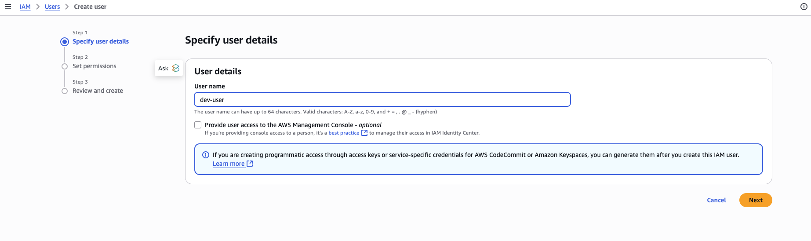

# Serverless LLM Apps with Amazon Bedrock

This project demonstrates how to build scalable, serverless applications powered by large language models (LLMs) using Amazon Bedrock. By leveraging Bedrock's managed foundation models and AWS serverless services, you can quickly prototype, deploy, and scale AI-driven applications without managing infrastructure. The repository provides examples, best practices, and templates to help you integrate LLM capabilities into your own serverless workflows.

### The first step is to have an IAM account

To get started, you need an AWS Identity and Access Management (IAM) user account with the necessary permissions. If you don't have one:

1. **Sign in to the AWS Management Console** using your root account or an existing IAM user with administrative privileges.
2. **Navigate to IAM**: In the AWS Console, search for "IAM" in the Services search bar and select it.
3. **Create a new IAM user**:
    - Click on **Users** in the sidebar, then select **Add users**.
    - Enter a user name and select the desired access type (e.g., programmatic access, AWS Management Console access).
    - Assign appropriate permissions, such as attaching existing policies like `AdministratorAccess` or creating a custom policy with the required permissions for your project.
    - Complete the steps to create the user and securely save the access credentials.

For more detailed instructions, refer to the [AWS IAM User Guide](https://docs.aws.amazon.com/IAM/latest/UserGuide/id_users_create.html).

I skipped to add any policy and then by clicking next the user will be created 
