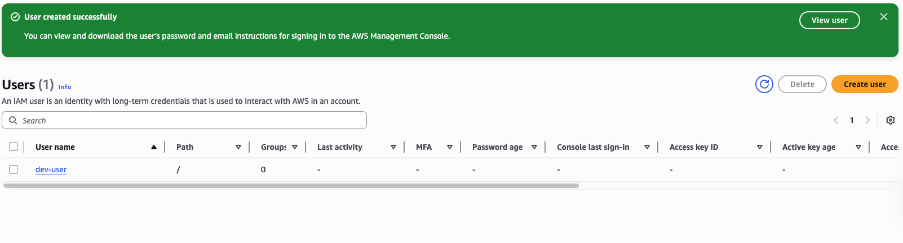

# Serverless LLM Apps with Amazon Bedrock

This project demonstrates how to build scalable, serverless applications powered by large language models (LLMs) using Amazon Bedrock. By leveraging Bedrock's managed foundation models and AWS serverless services, you can quickly prototype, deploy, and scale AI-driven applications without managing infrastructure. This repository provides examples, best practices, and templates to help you integrate LLM capabilities into your own serverless workflows.

---

### Step 1: Set Up an IAM User

To get started, you need an AWS Identity and Access Management (IAM) user account with the necessary permissions. If you don't have one, follow these steps:

1. **Sign in to the AWS Management Console**  
    Use your root account or an existing IAM user with administrative privileges.

2. **Navigate to IAM**  
    In the AWS Console, search for "IAM" in the Services search bar and select it.

3. **Create a New IAM User**  
    - Click on **Users** in the sidebar, then select **Add users**.
    - Enter a user name and select the desired access type (e.g., programmatic access, AWS Management Console access).
    - Assign permissions:
      - You can attach existing policies like `AdministratorAccess` for full access, or create a custom policy with only the permissions required for your project.
      - If you skip assigning permissions during user creation, you can add them later.
    - Complete the steps to create the user and securely save the access credentials.

    

4. **Add Permissions (Optional at Creation)**  
    If you skipped adding permissions during creation, you can assign them later. For example, you might grant full access to Amazon S3:

    

5. **Organize Users with Groups (Recommended)**  
    For better management, you can create IAM groups with specific policies and add users to these groups. This approach helps you control access more efficiently and follow best practices for least privilege.

    

For more detailed instructions, refer to the [AWS IAM User Guide](https://docs.aws.amazon.com/IAM/latest/UserGuide/id_users_create.html).