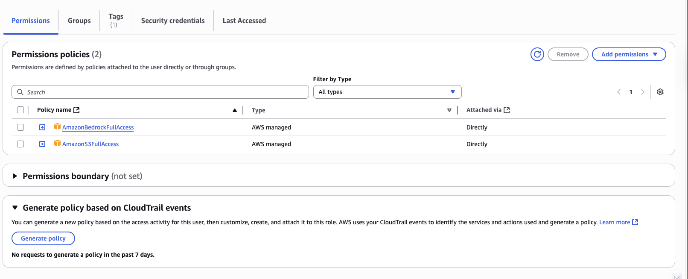
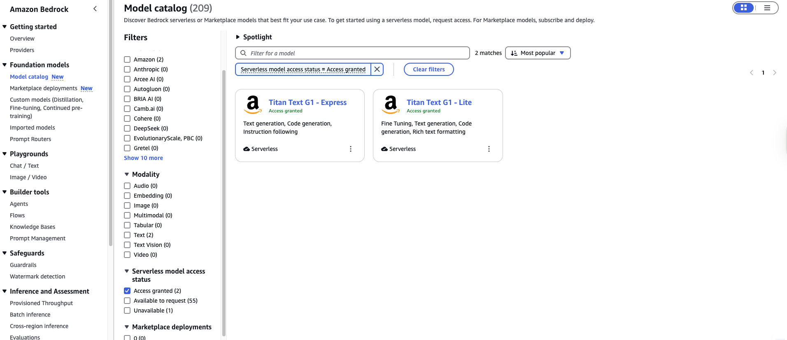
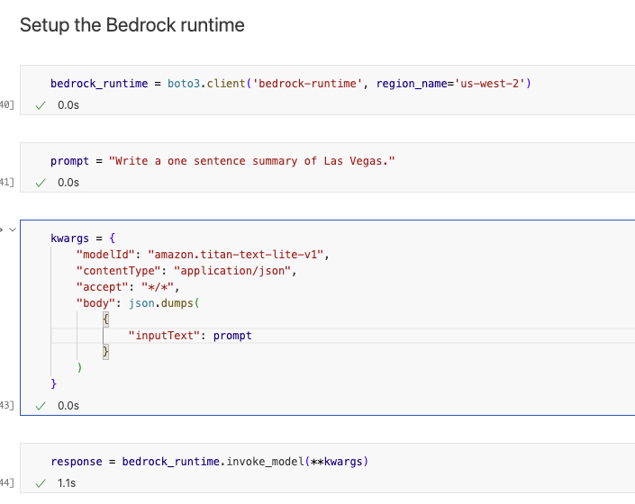

# Serverless LLM Apps with Amazon Bedrock

This repository showcases how to build scalable, serverless applications powered by large language models (LLMs) using Amazon Bedrock. By leveraging Bedrock’s managed foundation models and AWS serverless services, you can rapidly prototype, deploy, and scale AI-driven solutions without managing infrastructure. Inside, you’ll find practical examples, best practices, and templates to help you seamlessly integrate LLM capabilities into your own serverless workflows.

---

### Step 1: Set Up an IAM User

To begin, ensure you have an AWS Identity and Access Management (IAM) user with the necessary permissions. If you don’t have one, follow these steps:

1. **Sign in to the AWS Management Console**  
    Use your root account or an existing IAM user with administrative privileges.

2. **Open the IAM Service**  
    In the AWS Console, search for “IAM” in the Services search bar and select it.

3. **Create a New IAM User**  
    - Click **Users** in the sidebar, then select **Add users**.
    - Enter a user name and select the required access type (e.g., programmatic access, AWS Management Console access).
    - Assign permissions:
      - Attach existing policies like `AdministratorAccess` for full access, or create a custom policy with only the permissions your project needs.
      - If you skip assigning permissions now, you can add them later.
    - Complete the steps to create the user and securely save the access credentials.

    

4. **Add Permissions (If Not Added During Creation)**  
    If you skipped permissions, assign them now. For example, grant access to Amazon S3, or Bedrock:

 
    

5. **Organize Users with Groups (Recommended)**  
    For better management, create IAM groups with specific policies and add users to these groups. This helps enforce least privilege and simplifies access control.

    

After assigning permissions, generate an access key and secret access key for your IAM user. These credentials are required for programmatic access to AWS services:

1. In the IAM console, select your user.
2. Go to the **Security credentials** tab.
3. Under **Access keys**, click **Create access key**.
4. In the **Access key best practices & alternatives** section, select **Other** to review recommendations for secure key management.
5. Optionally, add a description for future reference.
6. Download and securely store the access key ID and secret access key.  
    **Important:** You will not be able to view the secret access key again after this step.

Use these credentials to configure the AWS CLI or SDKs for development.


For more details, see the [AWS IAM User Guide](https://docs.aws.amazon.com/IAM/latest/UserGuide/id_users_create.html).

---

### Step 2: Install the AWS CLI

For macOS, run the following commands in your terminal to download and install the AWS CLI. Always check the [official documentation](https://docs.aws.amazon.com/cli/latest/userguide/getting-started-install.html) for the latest version and compatibility notes.

```sh
# Download the AWS CLI installer
curl "https://awscli.amazonaws.com/AWSCLIV2.pkg" -o "AWSCLIV2.pkg"

# Install the AWS CLI (requires administrative privileges)
sudo installer -pkg AWSCLIV2.pkg -target /
```

To verify the installation, run:

```sh
which aws
/usr/local/bin/aws
aws --version
aws-cli/2.27.22 Python/3.13.3 Darwin/24.5.0 exe/x86_64
```

---

### Step 3: Configure the AWS CLI

After installing the AWS CLI, configure it to use your IAM credentials and preferred settings. Open your terminal and run:

```sh
aws configure
```

You’ll be prompted to enter:

- **AWS Access Key ID**: Paste the access key you generated earlier in step 1.
- **AWS Secret Access Key**: Paste the corresponding secret access key.
- **Default region name**: Enter `us-west-2` (recommended for this project).
- **Default output format**: You can specify `json`, `yaml`, or leave blank for the default.

Example interaction:

```
$ aws configure
AWS Access Key ID [None]: "Access Key ID"
AWS Secret Access Key [None]: "Secret Access Key"
Default region name [None]: us-west-2
Default output format [None]: json
```

Your credentials and configuration will be saved in `~/.aws/credentials` and `~/.aws/config`. For advanced configuration options and best practices, refer to the [AWS CLI configuration documentation](https://docs.aws.amazon.com/cli/latest/userguide/cli-configure-files.html#cli-configure-files-methods).


### Step 4: Access to models
**Note:** This guide uses the `us-west-2` (Oregon) region. Ensure your AWS account is set to the same region, as access to the Titan Text G1 - Lite model may not be available elsewhere.

To enable the Titan Text G1 - Lite model in Amazon Bedrock:

1. In the AWS Console, search for **Amazon Bedrock**.
2. Open the **Model access** or **Model catalog** section.
3. Search for "lite" and locate the **Titan Text G1 - Lite** model.
4. Select the model and grant access as needed.

If you do not select the correct region or enable access, you may not be able to use this model.



You can follow the same steps above to request access to the **amazon.titan-text-express-v1** model. In the Amazon Bedrock console, search for "express" in the Model catalog, locate **Titan Text Express v1**, and enable access as needed. This allows you to use the more advanced Titan Text Express model in your serverless applications.

### Step 5: Finalizing

After completing the previous steps, you are ready to run the code in the `first_generations_with_amazon_bedrock.ipynb` notebook. This notebook demonstrates how to interact with Amazon Bedrock and generate text using the Titan Text G1 - Lite model.

To get started:

1. Open the `first_generations_with_amazon_bedrock.ipynb` notebook (located in 1_GenAmazonBedrock) in your preferred environment (such as Jupyter Notebook or VS Code).
2. Ensure your AWS CLI is configured and your credentials are available.
3. Follow the instructions in the notebook to execute the cells and observe the results.

You should now be able to generate text with Amazon Bedrock in a serverless workflow.

